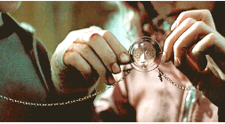

# ⏰ Hermione e o Vira-Tempo
Hermione Granger, uma estudante brilhante de Hogwarts, decidiu usar o Vira-Tempo (Time-Turner) para otimizar seu aprendizado tanto na Escola de Magia e Bruxaria de Hogwarts quanto no Instituto de Ciências Nórdicas (Cin).

O Vira-Tempo é um dispositivo mágico que permite a quem o utiliza voltar no tempo por algumas horas.



A agenda de Hermione está bastante agitada e ela precisa escolher quais aulas assistir em cada instituição para maximizar seu conhecimento. Cada aula tem um valor de conhecimento associado a ela.

## Inputs
A entrada do problema será da seguinte forma:
```
3 2  
5 8 3  
4 6  
5 
```

- A primeira linha contém dois números inteiros, n e m (1 ≤ n, m ≤ 50) representando o número de aulas em Hogwarts e no Cin, respectivamente.
- A segunda linha contém n inteiros, H1 a Hn, representando o valor de conhecimento associado a cada aula em Hogwarts.
- A terceira linha contém m inteiros, C1 a Сm (1 ≤ Ci ≤ 50), representando o valor de conhecimento associado a cada aula no Cin.
- A quarta linha contém um inteiro K (1 ≤ k ≤ 40), representando o número total de horas disponíveis no Vira-Tempo.
- Implemente um resolução utilizando uma árvore AVL para encontrar a combinação ideal de aulas que maximize o valor total de conhecimento, respeitando o limite de horas disponíveis no Vira-Tempo.

Obs: Cada aula tem o valor de 1, portanto, se K = 2, isso significa que é possível assistir duas aulas.

## Outputs
```
valor total de conhecimento: 26
```